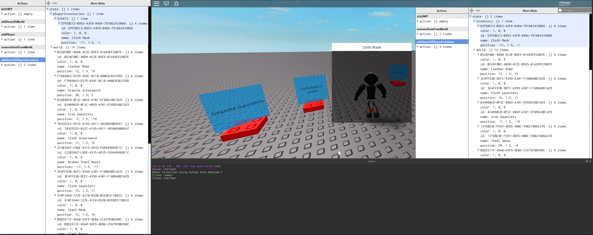

# Roact and Rodux Demo Project for RDC
This project is an example of some experimental ways to take advantage of Roact and Rodux in a game besides just UI.

It is not intended to be an indicator of best practices, but indicates some of the more interesting things you can do with Roact and Rodux.

## Overview
This project falls short of being an actual game. It contains a list-based inventory that can be opened with E, and a small number of items that are scattered on the ground.

Stepping on an item adds it to your inventory, and clicking on an item in your inventory drops it on the ground in front of you.

The UI, including the inventory and item name pop-ups are rendered using Roact.

The game world itself is managed mostly by Roact with some manually managed properties as an example of how to keep a non-declarative system in sync with Rodux.

## Key Features

### Hot-Reloading Shim
Roact and Rodux lend themselves well to hot-reloading code, which enables modifying a game as its running without restarting it or losing any state.

The React ecosystem has [React Hot Loader](https://github.com/gaearon/react-hot-loader) for doing that directly with React components, but Roact has no parallel right now.

The Redux pattern, however, is trivial to hot-reload: just keep a list of actions that have been dispatched so far, and on reload, play them back.

Because this project is using a network replicated Rodux store, this is a bit trickier. I didn't have time to fully explore the idea, but I think there's a lot of interesting potential here. Any robust solution would want to timestamp actions and interleave client/server actions when reloading on playback.

Hot-reloading can be taken advantage of by running the game in either play solo or server-client mode and using Rojo polling on the server DataModel. As code updates on the filesystem, it will be synced into the game, and the hot-reload shim will trigger a reload.

Take a look at `src/HotReloadClient.lua` and `src/HotReloadServer.lua` for the shim, and then `src/server/init.server.lua` and `src/client/init.client.lua` for the project-specific implementations.

There are a couple known issues relating to state not being replicated again after a reload, which could be solved by special-casing pieces of state. I didn't explore this problem space very thoroughly, but I think there could be some powerful techniques to apply.

### Replicated Rodux Store
An idea that [David Minnerly (Vocksel)](https://github.com/vocksel) proposed awhile ago was to send Rodux actions over the network to synchronize stores across multiple peers.

In this project, I tried to build some minor tooling around the idea.

There are a set of common reducers, located in `src/common/commonReducers` that represent state that must be in sync for each client. In this project, that includes the set of items that are located in the world.

Both the server and client have their own reducers for private state, located in `src/server/serverReducers` and `src/client/clientReducers` respectively.

The server chooses which actions to replicate to the client based on a couple simple rules:

* Any action that mutates a reducer defined in `commonReducers` is always replicated to all clients.
* Any action that has the property `replicateBroadcast` set to `true` is always replicated to all clients.
* Any action that has the property `replicateTo` set to a user's ID will replicate to that user.

The client communicates back by firing events, which have tighter validation and often can't be represented solely by state transitions.

### Strongly-Typed Remote Interface
Unrelated to Roact and Rodux, I wrote a declarative typechecking interface for annotating functions. We don't have static strong typing on Roblox yet, but strict runtime guards and high test coverage are a step in the right direction.

All communication between the client and server is facilitated by `RemoteEvent` objects created on the server. The objects, their directionality, and their argument validators are specified in `src/common/ApiSpec.lua`.

The client and server generate objects with regular method calls for each event specified in the spec, which is rigorously checked. Look at `src/client/ClientApi.lua` and `src/server/ServerApi.lua` for those implementations.

On the server, events can be sent to specific players or broadcasted by either passing a specific user ID as the first argument, or the special value `AllPlayers`. I think that encoding broadcasting vs single player transmission as the same method is easier to reason about.

Types are checked on both the sending and receiving ends. On the sending end, we want to make sure that we're putting the right values into the remote. Validation is done on the receiving end as well as a first-pass guard against malicious clients.

The type declaration library is located in `src/common/Typer.lua`. Most of the code is not all that pretty, and it underwent several iterations before landing where it is right now.

[Osyris](https://github.com/osyrisrblx) built a runtime type checking system that's very similar to Typer called [t](https://github.com/osyrisrblx/t). If you're interested in pursuing this idea further, that's a great place to start.

### Library Previews
Some of the techniques and files in the project come from projects that we haven't released yet.

`src/common/Dictionary.lua` and `src/common/None.lua` come from a project called Cryo that we'll be releasing later this year. Cryo provides utilities for writing functional programs and for working with immutable data structures, and `Dictionary` is one part of it!

A number of source files reference the "Redux Visualizer" or "Redux DevTools". That project isn't quite ready for release, but when everything is hooked up, it looks like this:

Using the visualizer, it's possible to inspect into both the client and server Rodux stores and visualize all of their values in real time, as well as step backwards and forward through time!

### World Rendered with Roact
An unusual feature of this project is that the main game world is rendered declaratively with Roact. Most projects probably won't go down this route, but it stands as an interesting example of non-Roact interaction with Roact-controlled elements.

Items dropped in the world are managed by Roact and thus the reconciliation process, but the single-axis billboarded GUIs are oriented towards the camera in a `RenderStepped` loop.

## License
This project is available under the CC0 1.0 Universal license. Details are available in [LICENSE](LICENSE). Generally, that means you can whatever you want with it!